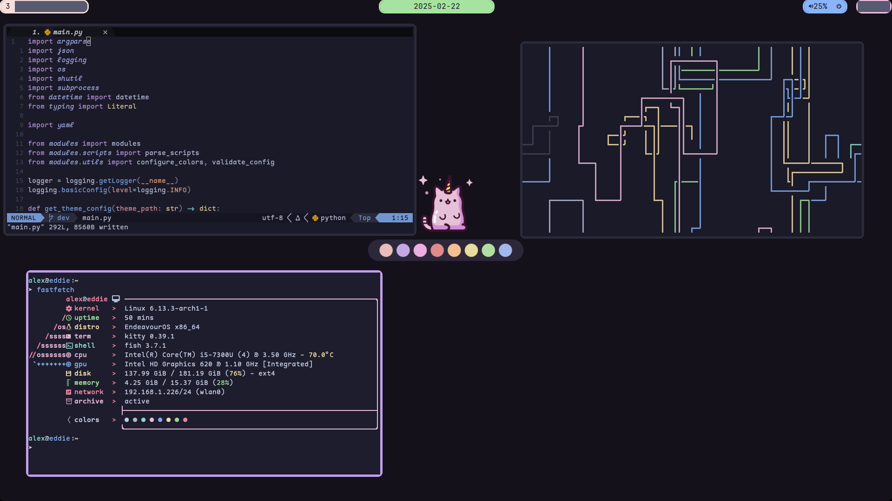
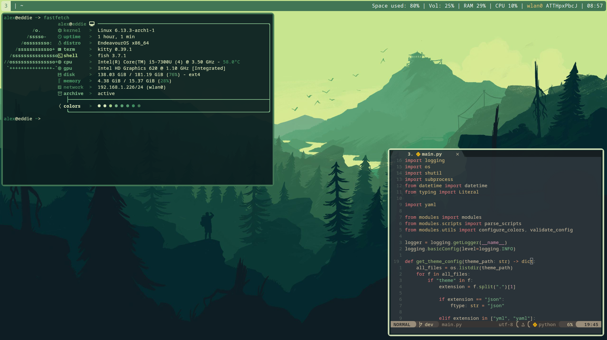
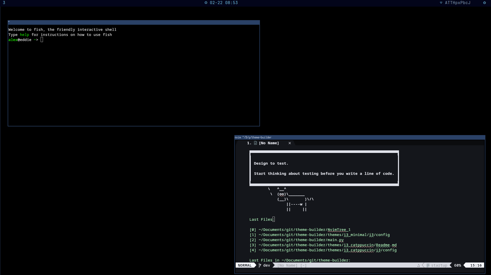

# Theme Builder 

This is a theme / rice builder for linux systems. It's a way to quickly switch
your dotfiles between different desktop environments / themes. 

Each program or tool has a base configuration defined in `default_configs`. Each
theme is configured in the themes folder by a `themes.yaml` file along with
configuration files that append or overwrite the default configurations. This
way, you define what you want to be common among all themes (e.g. keybindings)
in `default_configs` and define the theme-specific differences in the
theme-specific folder.







# Disclaimer

This project is primarily for personal use and I take no responsibility for
what happens to your system if you use this. Make sure you back up critical
files before running this. Please note that I'm currently in a phase where I'm
incapable of leaving my neovim config alone, so if you want to use this project,
I suggest you fork it and make your own default neovim config.

# Quickstart

## Installation 
Any modern version of python should suffice. To set up the project, simply clone
the repo, set up a virtual environment, and install matplotlib and toml.

```bash 
git clone git@github.com:apalermo01/theme-builder.git
cd theme-builder 
python -m venv env 
source ./env/bin/activate 
pip install -r requirements.txt
chmod +x ./switch_theme.sh
chmod +x ./switch_theme_nvim_only.sh
chmod +x ./switch_theme_wsl_compat.sh
chmod +x ./random_theme.sh

```

## Changing Themes

To switch between theme, run the switch_theme script:

```bash
./switch_theme.sh <theme name>
```

This script is a wrapper on main.py that has some more options:

```bash 
python main.py --theme i3_catppuccin \        # theme names found in the themes folder
               --no-test \                    # turns off test cases
               --migration-method copy \      # set this to None to overwrite nothing and inspect the build folder
               --destination-root $HOME \     # where the theme should get moved to
               --destination-structure config # config if you want to move directly to home directory
                                              # roles if you want to use some other automation tool to install the dotfiles
               

```

# Configuration 

See the wiki for a full list of configuration options. Additionally you can see
some example configurations by inspecting `theme.yaml` in any folder under
`themes` or `tests`

Each of the folders inside `./themes/` represents a specific theme / rice. The
options for each theme are specific inside the `theme.json` file, where the key
is the program name and the theme-specific settings are in the nested json.

Any files that are appended / copied are in the `./themes/theme_name/tool`
folder. For example, custom options for i3 configuration for the trees theme
live in `./themes/theme_name/i3/config`. 

# Roadmap
- [x] restructure temporary dots repo 
- [x] configure custom scripts that get moved to home directory 
- [x] configure custom scripts that run when the theme is switched
- [ ] make dedicated dotfiles repo 
- [ ] make new option for builder to move dots into repo instead of directly to the final destination
- [x] convert all theme configs to yaml
- [ ] set up hyprland / waybar
- [ ] write up comprehensive documentation
- [ ] add better screenshots + workflow documentation

**other programs to add**
- [ ] sioyek
- [ ] zathura
- [ ] firefox (if possible)
- [ ] zen (if possible)


# Credits
Big thanks to Stavros Grigoriou (stav121) for providing the initial inspiration
for this project: https://github.com/stav121/i3wm-themer.


